# 🔐 Secure Health Vault

A backend system for secure storage and transmission of healthcare data with encryption, access control, and audit logging.

---

## 🚨 Problem

Healthcare data is highly sensitive but often lacks strong protection during transmission and storage, making it vulnerable to breaches, unauthorized access, and tampering.

---

## ✅ Solution

This system secures healthcare data through:

* Encryption before storage and transmission  
* Role-based access control (RBAC)  
* Tamper detection using audit logs  
* Replay protection using nonces  

---

## 🏗️ Architecture

Frontend (HTML/Jinja) → Flask API → Hybrid Encryption Layer (AES + RSA) → Secure Storage

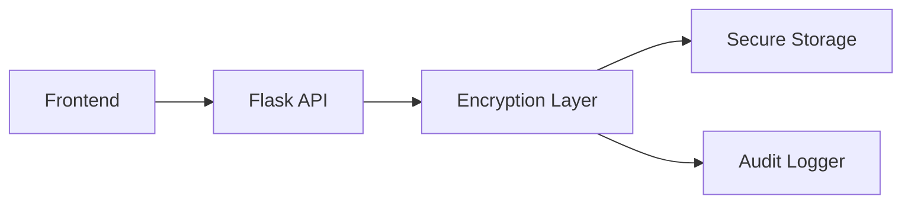

---

## ⚙️ Key Features

* End-to-end encryption using AES-256-GCM + RSA-2048
* Role-Based Access Control (Admin, Doctor, Patient)
* Secure key exchange and authentication
* Audit logging with tamper detection
* Secure email transmission of encrypted data

---

## 🎥 System Demo

### Dashboard
Interface for managing patient records, monitoring system activity, and handling secure data workflows.

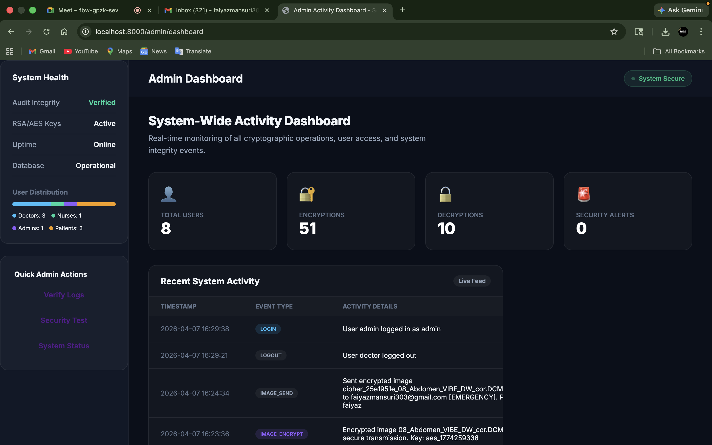

### Encryption Workflow
The system processes sensitive medical records by generating ephemeral AES keys, which are then securely "wrapped" using the recipient's RSA-2048 public key.

| Payload Structure (JSON) | Encryption Interface |
| :---: | :---: |
| 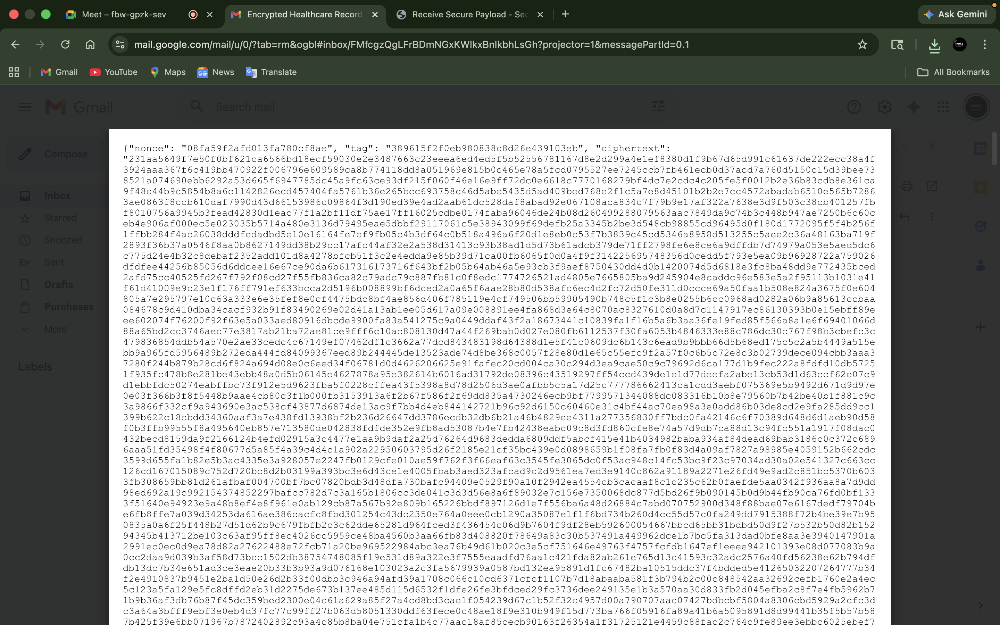 | 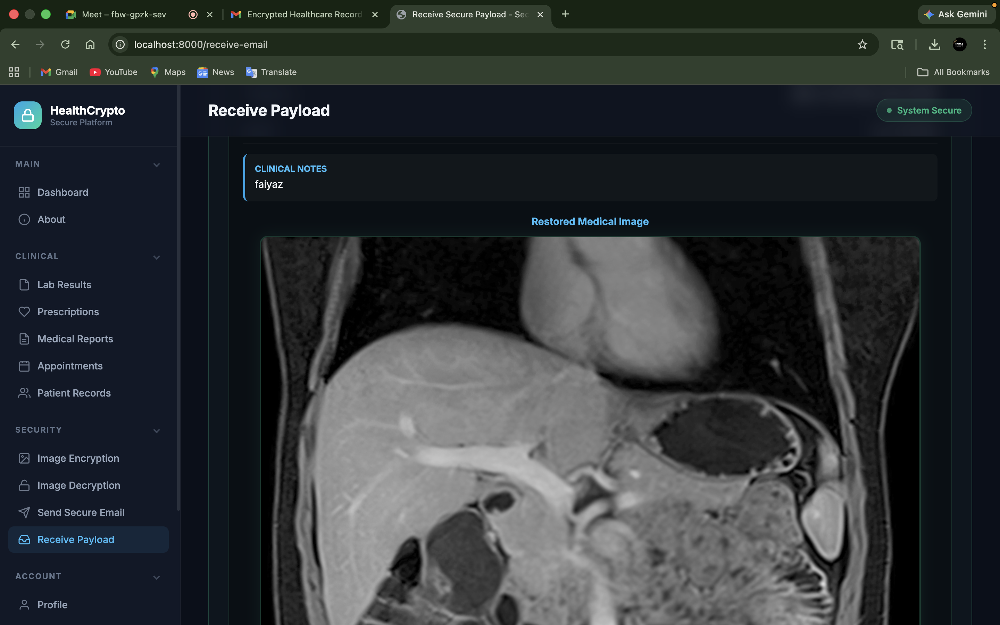 |

### Secure Email
Encrypted healthcare records are transmitted as secure attachments. The recipient receives a notification and can only unlock the data using their unique RSA private key.

| Gmail Inbox | Received Attachment |
| :---: | :---: |
| 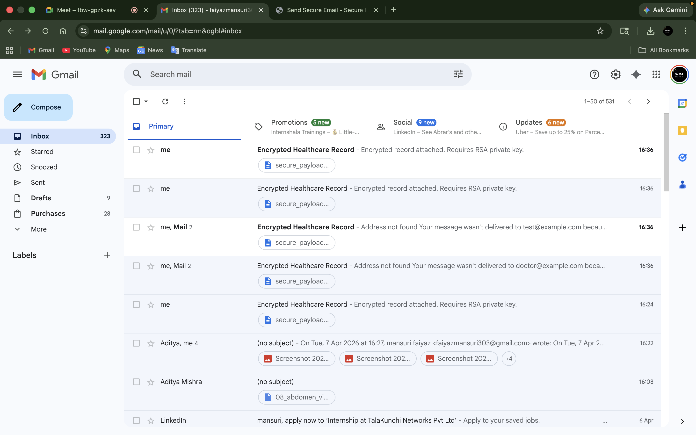 | 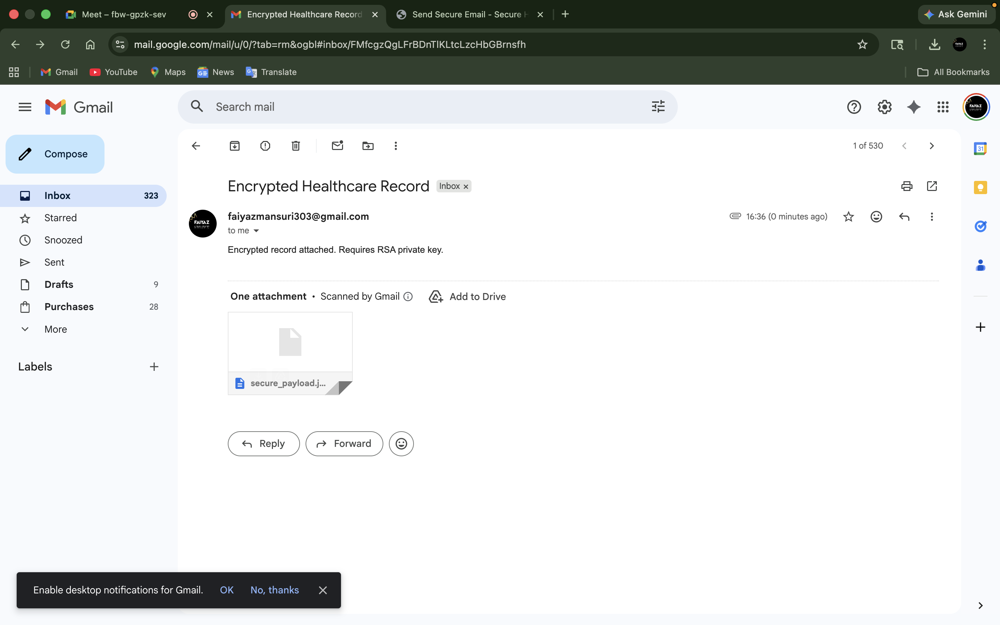 |

### Decryption
Authorized personnel can verify and decrypt records. The system ensures that the integrity of the data is maintained throughout the lifecycle.

| Decrypt Interface | Decryption Success |
| :---: | :---: |
| 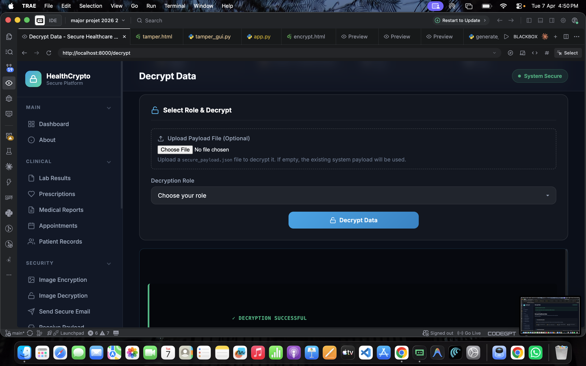 | 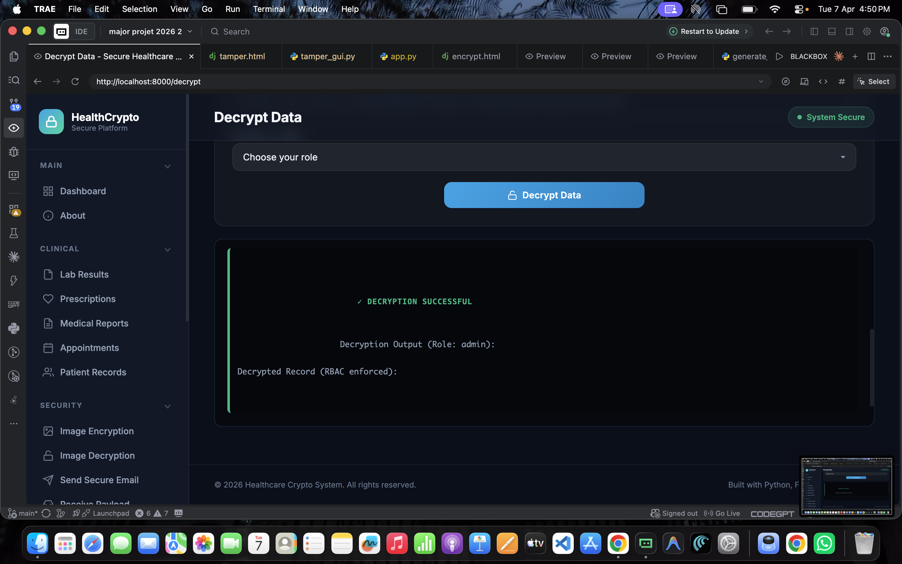 |

---

## ▶️ Run Locally

```bash
pip install -r requirements.txt
python init.py
python run.py
```

---

## 🧪 CLI Commands

```bash
python backend/main.py encrypt
python backend/main.py decrypt admin
python backend/main.py verify
```

---

## 📊 Security Validation

### Metrics
* **Entropy ≈ 7.99** (Near-perfect randomness)
* **NPCR ≈ 99.6%** (High sensitivity to plaintext changes)
* **UACI ≈ 33.4%** (Optimal average intensity change)
* **PSNR = Infinite** (Lossless decryption)

### Histogram Analysis
A secure encryption system should produce a uniform (flat) histogram, providing zero information about the original data.

| Original Image Histogram | Encrypted Image Histogram | Decrypted Image Histogram |
| :---: | :---: | :---: |
| 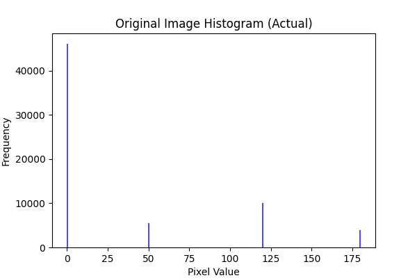 | 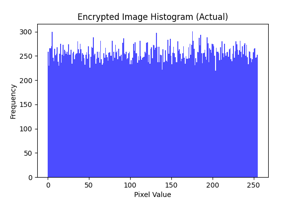 | 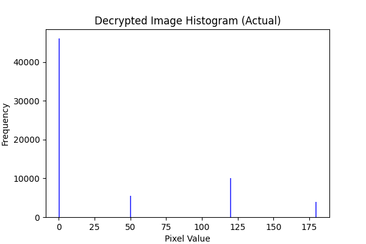 |

### Entropy Heatmap
Ensures high entropy across the entire payload to resist statistical analysis.

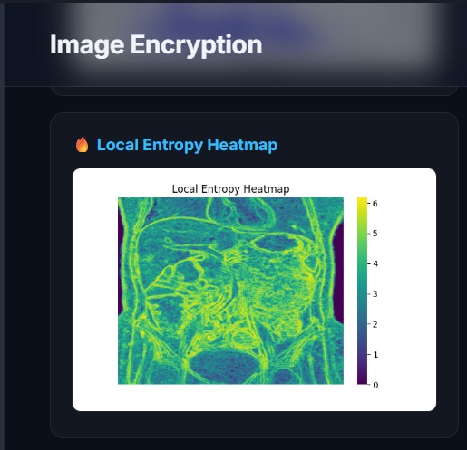

---

## 🛠 Tech Stack

Python | Flask | PyCryptodome | Matplotlib | JSON Storage

---

## 🚀 Future Improvements

* PostgreSQL integration
* Cloud key management (AWS KMS / Azure Key Vault)
* Client-side encryption
* API documentation (Swagger/OpenAPI)

---

## 📌 Note

This project demonstrates secure backend system design for handling sensitive healthcare data.
